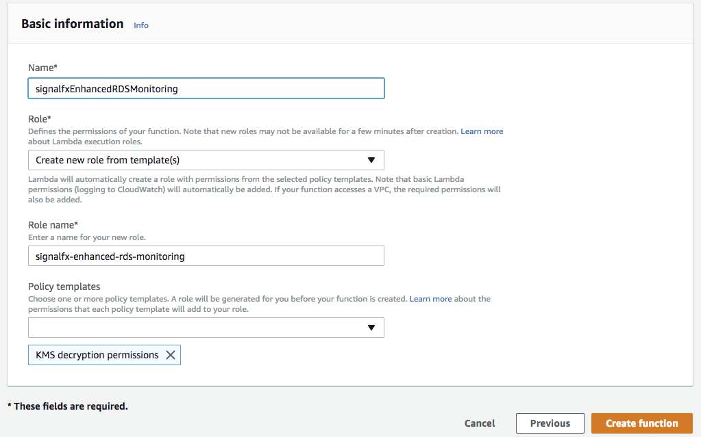
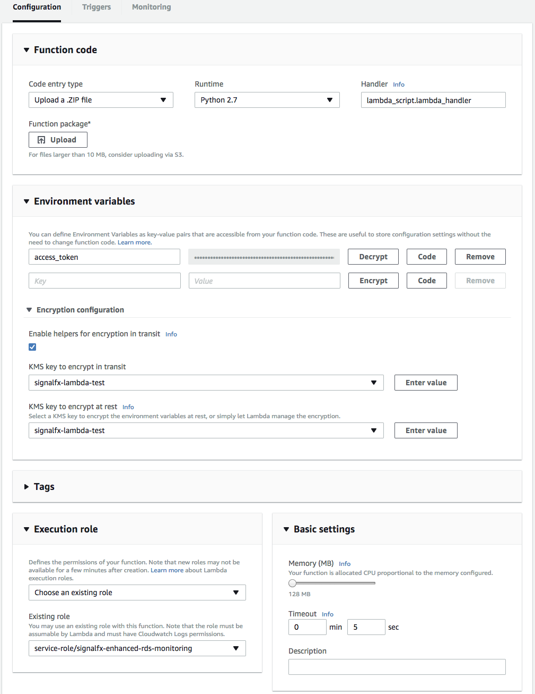
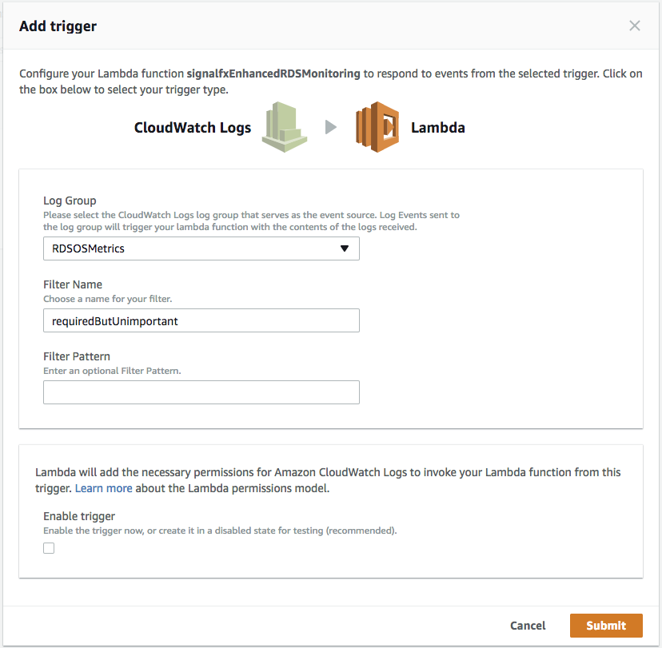

#  Amazon Relational Database Service (RDS)

- [Description](#description)
- [Installation](#installation)
- [Usage](#usage)
- [Metrics](#metrics)
- [License](#license)

### DESCRIPTION

Use SignalFx to monitor Amazon Relational Database Service (RDS) via [Amazon CloudWatch](https://github.com/signalfx/integrations/tree/master/aws)[](sfx_link:aws).

#### FEATURES

##### Built-in dashboards

- **RDS Instances**: Overview of all data from RDS.

  [](./img/dashboard_rds_instances.png)

- **RDS Instance**: Focus on a single RDS instance.

  [](./img/dashboard_rds_instance.png)

### INSTALLATION

To access this integration, [connect to CloudWatch](https://github.com/signalfx/integrations/tree/master/aws)[](sfx_link:aws). 

By default, SignalFx will import all CloudWatch metrics that are available in your account. To retrieve metrics for a subset of available services or regions, modify the connection on the Integrations page.

#### RDS ENHANCED MONITORING

SignalFx supports an integration with [RDS Enhanced Monitoring](http://docs.aws.amazon.com/AmazonRDS/latest/UserGuide/USER_Monitoring.OS.html) using an AWS Lambda function, described below. This integration also includes built-in dashboards designed specifically for the metrics from Enhanced Monitoring. This Enhanced Monitoring integration complements the CloudWatch-based integration described above.  

To use this integration, you must have RDS Enhanced Monitoring enabled. [Click here for details](http://docs.aws.amazon.com/AmazonRDS/latest/UserGuide/USER_Monitoring.OS.html).

You will also need an [encryption key set up in AWS](http://docs.aws.amazon.com/kms/latest/developerguide/create-keys.html). Make sure to add the users who will need to have access to the Lambda function, as well as appropriate admins.

##### 1. Download code and build the archive

In a bash shell, copy and paste the following commands:

```sh
$ git clone https://github.com/signalfx/enhanced-rds-monitoring.git
$ cd enhanced-rds-monitoring
$ ./build.sh
$ tox # Optional: verify the build.
```

After running this sequence of commands, you will have a copy of `enhanced_rds.zip`. This will be the zip archive you upload to the Lambda function in a later step.

##### 2. Create a new Lambda function

Create a new Lambda function on the Functions page of the AWS Management Console. 

Under Basic Information, the only required function permission is 'KMS decryption permissions'. You can either use a preexisting role that already has this permission, or create a new role from the templates that AWS provides. To create a new role, select `Create new role from template(s)` from the Role dropdown, create a descriptive name for the role, and under Policy templates, select `KMS decryption permissions`.



##### 3. Configure the function

Go to the Configuration tab. 



Under 'Code entry type' select `Upload a .ZIP file`. Set the runtime to `Python 2.7`. Set 'Handler' to be `lambda_script.lambda_handler`. Click 'Upload', and find the `enhanced_rds.zip` file you built earlier. The file should be about 3 MB; if it isn't, the archive may not be built correctly, so you should try going through the process described above again.

###### Supply your SignalFx access token

Under 'Environment Variables', create an environment variable named `access_token` and add your SignalFx access token. [Click here for more information about SignalFx access tokens](https://docs.signalfx.com/en/latest/admin-guide/tokens.html#managing-access-tokens). 

Expand the 'Encryption configuration' section and check the box under 'Enable helpers for encryption in transit'. From the 'KMS key to encrypt in transit' and 'KMS key to encrypt at rest' dropdown menus, select the encryption key you created earlier. An 'Encrypt' button will appear next to your environment variables. Click it to activate the encryption.

###### Finish up configuration 

For Execution role, select `Choose an existing role` and select a role with the required permissions (see Basic Information, above). 

Change the default 3 second timeout to 5 seconds.

##### 4. Add a trigger

On the Triggers tab, click Add Trigger. 


Click on the perforated box and select CloudWatch Logs from the list. A number of additional options will appear. Select `RDSOSMetrics` under 'Log Group', and select an appropriate 'Filter Name'. Leave 'Filter Pattern' empty. 

We recommend that you deselect the 'Enable trigger' option so that you can review your settings before activating your Lambda. You can enable the trigger from the Triggers tab at any time.



When you are satisfied with your configuration settings, enable the trigger, and you're good to go! Your metrics will shortly be on their way to SignalFx ingest, and built-in dashboards for RDS Enhanced Monitoring will appear on the Dashboards page in SignalFx. 

###### Optional: Specify a subset of available metrics to send to SignalFx 
To specify that SignalFx should collect only a subset of the metrics available from Enhanced Monitoring, create an environment variable to store the desired list. You can either include only the specified groups, or exclude all but the specified groups. 

The key for this environment variable is `groups` for the inclusive group or `groups_out` for the exclusive group. The list should simply be the names of the groups, spelled exactly as they are in the documentation (including capitals), separated by a single space. If you create both lists, only the `groups` list will be used.

E.g.
`cpuUtilization diskIO memory OSprocesses`

The complete list of available metrics can be found [here](http://docs.aws.amazon.com/AmazonRDS/latest/UserGuide/USER_Monitoring.OS.html).

Available Metric Groups (all but SQL Server):

- `cpuUtilization`
- `diskIO`
- `fileSys`
- `loadAverageMinute`
- `memory`
- `network`
- `OSprocesses`
- `RDSprocesses`
- `swap`
- `tasks`

Available Metric Groups (SQL Server only):

- `cpuUtilization`
- `disks`
- `memory`
- `network`
- `OSprocesses`
- `RDSprocesses`
- `system`

NOTE: While '`OSprocesses`' and '`RDSprocesses`' are not listed groups in the AWS documentation, they are metric groups that we provide.

### USAGE

SignalFx provides built-in dashboards for this service. Examples are shown below.


### METRICS

For more information about the metrics emitted by Amazon Relational Database Service, visit the service's homepage at https://aws.amazon.com/rds/.
  
### LICENSE

This integration is released under the Apache 2.0 license. See [LICENSE](./LICENSE) for more details.
